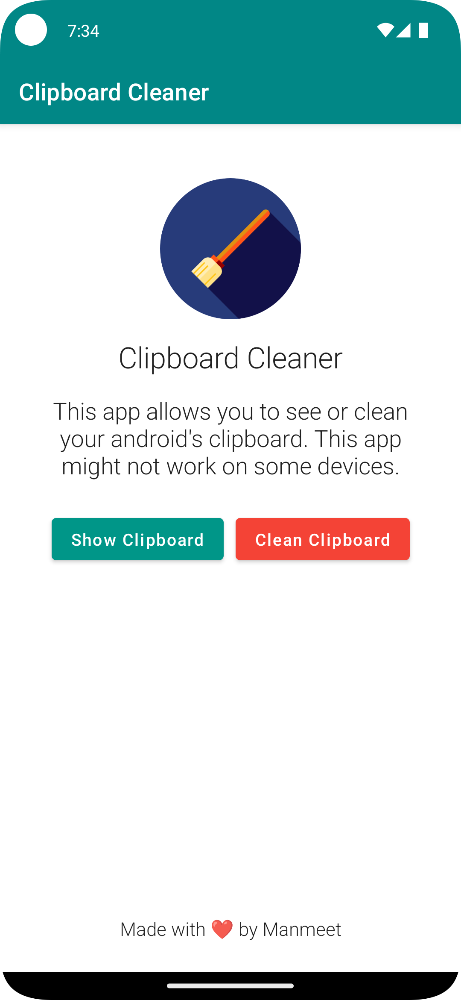

# Clipboard Cleaner

An android app for showing and cleaning clipboard. This app have a simple interface with only two
buttons, `Show Clipboard` and `Clean Clipboard`. Both shows a small message (Toast) at the bottom with
one showing the last copied text in clipboard while other clears the clipboard completely.

## 🛠️ Technologies Used 
- Kotlin
- Jetpack Compose

## ⚠️ Note
On some android devices the clipboard cleaning might not work as some vendors implement their own method of managing clipboards.

## 🌠 Screenshot


## ⬇ Download

<a href="https://apt.izzysoft.de/fdroid/index/apk/com.thatsmanmeet.clipboardcleaner" target="_blank"></a>

Or Go To download the app go to releases page and download the latest `app-release.apk` file from the latest release tag.

## 🤝🏻 Contribute
```markdown
 - Fork the branch
 - clone it into your system
 - Make changes and commit  
 - create pull request
```

## 👨🏼‍⚖️ License

This app uses GPL V3.0 License.

## ＠ Credits

The icon of this app is taken from flaticons website.
<a href="https://www.flaticon.com/free-icons/painter" title="painter icons">Painter icons created by Freepik - Flaticon</a>
