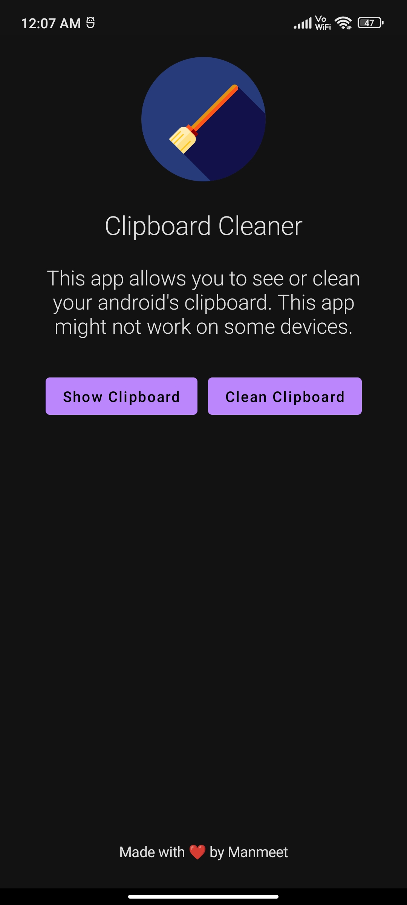

# Clipboard Cleaner
An android app for showing and cleaning clipboard.

## 🛠️ Technologies Used 
- Kotlin
- Jetpack Compose

## ⚠️ Note
On some android devices the clipboard cleaning might not work as some vendors implement their own method of managing clipboards.

## 🌠 Screenshot

## ⬇ Download
To download the app go to releases page and download the latest `app-release.apk` file from the latest release tag.

## Credits

The icon of this app is taken from flaticons website.
<a href="https://www.flaticon.com/free-icons/painter" title="painter icons">Painter icons created by Freepik - Flaticon</a>
